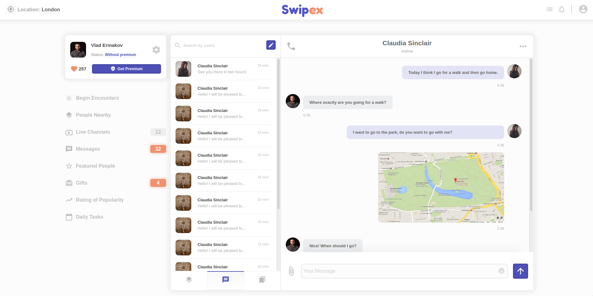

<!-- TITLE -->
# SwipEx
A mobile application to find new acquaintaces.
>  An implementation of the [SwipEx app](https://www.behance.net/gallery/70285515/Swipex-This-application-for-dating), designed by [Vlad Ermakov](https://www.behance.net/ermalength) from [Fireart Studio](https://www.behance.net/fireart). built as part of Microverse's Full Stack Development program

<!-- DESCRIPTION -->
This personal project is the capstone project form Microverse's HTML-CSS module. 
[Bootstrap](https://getbootstrap.com/) with custom breakpoints is used extensively, re-arranging the content with its responsible break-points and changing margins and paddings accordingly.   
The project styling is done through [SASS](https://sass-lang.com/), organized in modularized units. 

<!-- AUTHORS -->
## Check it online!
[Live preview](https://raw.githack.com/fc-anjos/capstone-project-html-css/social-network-dev/pages/chat.html)

<!-- SCREENSHOT -->
_Screenshot_

## Built With
    html
    bootstrap
    scss (bootstrap)

<!-- AUTHORS -->
## Implemented By:
* Felipe dos Anjos  
GitHub: [@fc-anjos](https://github.com/fc-anjos)  
LinkedIn: [Felipe dos Anjos](https://www.linkedin.com/in/felipe-cavalheiro-dos-anjos-4792a8176/)  

## Designed by 
* Vlad Ermakov
Behance: [Vlad Ermakov](https://www.behance.net/ermalength)

<!-- LICENSE -->

### Contributions and issues are welcome!

